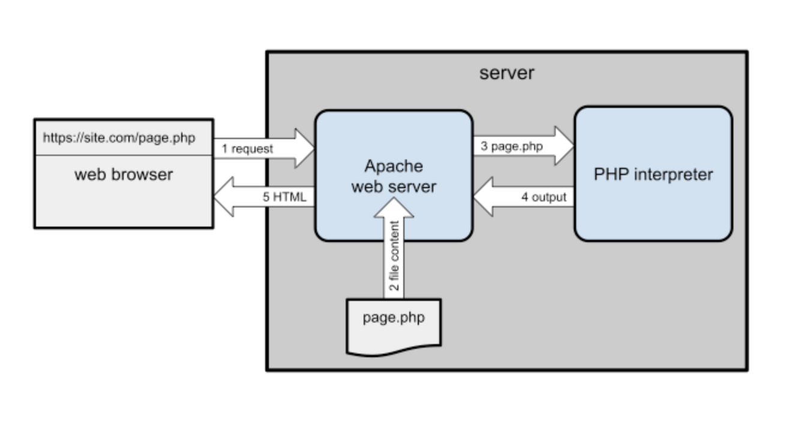
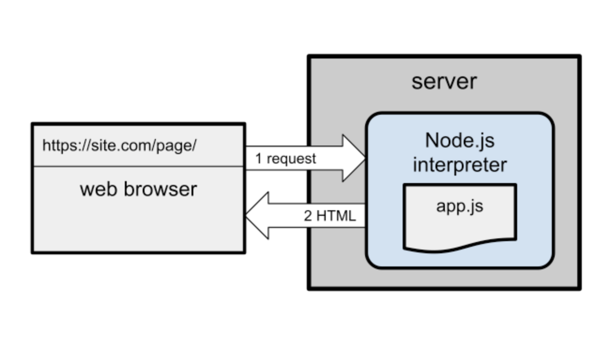

# Node.js: Novice to Ninja
[Course link](https://learning.oreilly.com/library/view/node-js-novice-to/9781098141004/Text/ultimatenode1-frontmatter.html)

## 1. What's Node.js?
* JS runtime
* Use to create CLI tools, web servers etc
* 2005: ECMA script 5, standard support for most of the browsers
* npm - Node package manager

Why learn JS?
* Most used language in GitHub
* Ranked highly by developers

Why learn NodeJs?
* it's JS
* Fast
  * non-blocking
  * event-driven
  * runs on a single processing thread, long running tasks (db query) are processed asynchrnously
    * Doesn't halt execution
    * Task runs in the background
    * NodeJS continues the next command
    * when task is complete, return data to a callback function
* Real time
  * live chat, multiplayer games
* Lightweight
  * runtime is small & cross-platform
* Extendable
  * npm: largest in the world
* opensource

## 2. Install Node.js

## 3. Your first NodeJS application
### Console app

Run hello.js
```bash
mkdir console
cd console
node hello.js
```

First line

`#!/usr/bin/env node`
* shebang line
* optional when running using bash command
* Need it when running as `./hello.js`

```bash
node hello.js Craig
```
* ele 0: node command
* ele 1: script
* ele 2: first argument

### Web server app
PHP web server


NodeJS web server


```bash
mkdir server
cd server
node webhello.js
Server running at http://localhost:3000/
```

Try accessing http://localhost:3000/, http://localhost:3000/abc/, or http://localhost:3000/abc/123/: 
every page is the same.

Restarting Node.js Applications with Nodemon
```bash
npm install -g nodemon
nodemon webhello.js

# code change
[nodemon] restarting due to changes...
[nodemon] starting `node webhello.js`
```

### Web Application Considerations
* Easy to start no db connections required
* Scaling can be difficult
  * More RAM/CPU to Apache/PHP will improve response time
  * NodeJS still runs on a single CPU, solution is clustering, pm2, docker containers by launching multiple instances
* Not efficient serving static files
  * Production: Nginx server to serve static files, direct request to node app when needed
* Write stateless applications
  * variable `userCount`
  * What would happen if you wanted to improve performance by launching two or more instances of the same app—perhaps on other servers
  * The `userCount` value would be different

